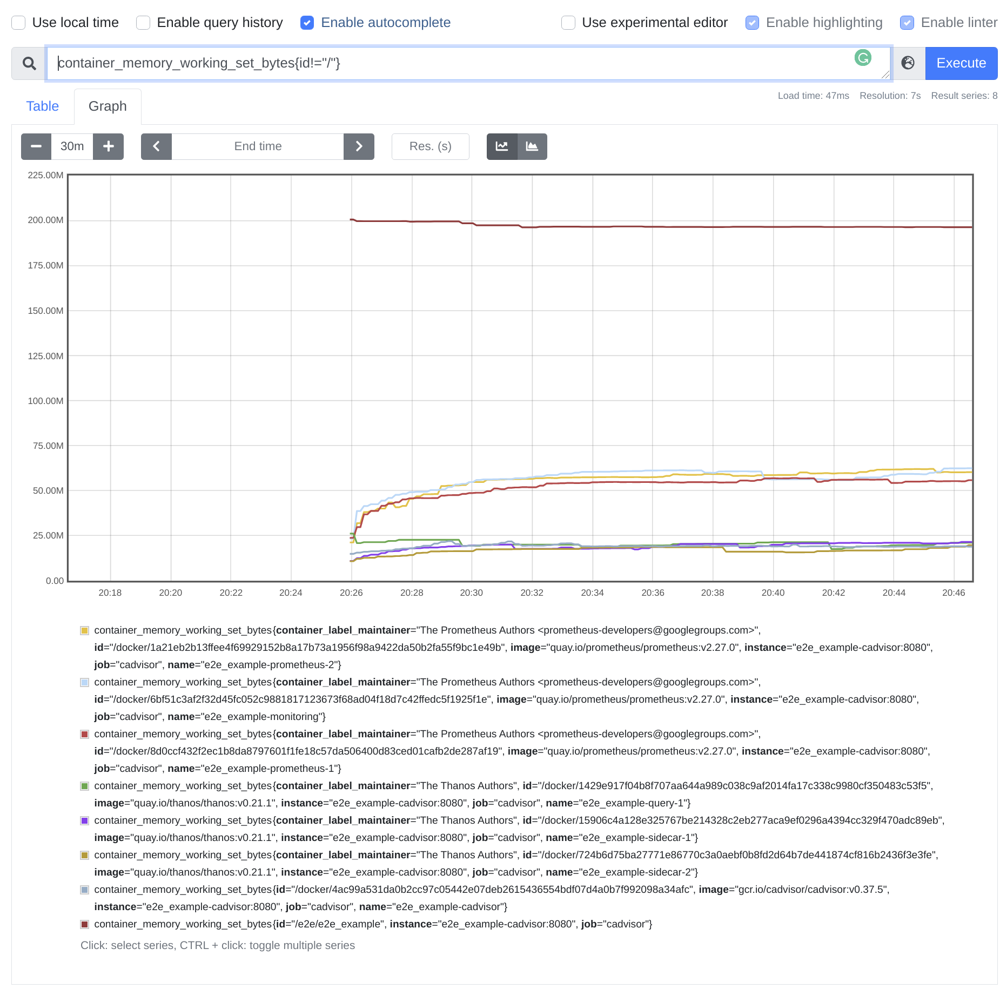

# e2e

[](https://pkg.go.dev/github.com/efficientgo/e2e)

Go Module providing robust framework for running complex workload scenarios in isolation, using Go and Docker. For integration, e2e tests, benchmarks and more! 💪

## What are the goals?

* Ability to schedule isolated processes programmatically from a single process on a single machine.
* Focus on cluster workloads, cloud native services and microservices.
* Developer scenarios in mind - e.g. preserving scenario readability and integration with the Go test ecosystem.
* Metric monitoring as the first citizen. Assert on Prometheus metric values during test scenarios or check overall performance characteristics.

## Usage Models

There are three main use cases envisioned for this Go module:

* *e2e test use* ([see example](examples/thanos/e2etest_test.go)). Use `e2e` in e2e tests to quickly run complex test scenarios involving many container services. This was the main reason we created this module. You can check usage of it in [Cortex](https://github.com/cortexproject/cortex/tree/master/integration) and [Thanos](https://github.com/thanos-io/thanos/tree/main/test/e2e) projects.
* *Standalone use* ([see example](examples/thanos/standalone.go)). Use `e2e` to run setups in interactive mode where you spin up workloads as you want *programmatically* and poke with it on your own using your browser or other tools. No longer need to deploy full Kubernetes or external machines.
* *Benchmark use*. Use `e2e` in local Go benchmarks when your code depends on external services with ease.

### Getting Started

Let's go through an example leveraging the `go test` flow:

1. Get the `e2e` Go module to your `go.mod` using `go get github.com/efficientgo/e2e`.
2. Implement a test. Start by creating an environment. Currently `e2e` supports Docker environment only. Use a unique name for all of your tests. It's recommended to keep it stable so resources are consistently cleaned.

   ```go mdox-exec="sed -n '24,28p' examples/thanos/e2etest_test.go"
   	// Start isolated environment with given ref.
   	e, err := e2e.New()
   	testutil.Ok(t, err)
   	// Make sure resources (e.g docker containers, network, dir) are cleaned.
   	t.Cleanup(e.Close)
   ```

3. Implement the workload by creating `e2e.Runnable`. Or you can use existing runnables in the [e2edb](db/) package. For example implementing a function that schedules Jaeger with our desired configuration could look like this:

   ```go mdox-exec="sed -n '42,48p' examples/thanos/standalone.go"
   	j := e.Runnable("tracing").
   		WithPorts(
   			map[string]int{
   				"http.front":    16686,
   				"jaeger.thrift": 14268,
   			}).
   		Init(e2e.StartOptions{Image: "jaegertracing/all-in-one:1.25"})
   ```

4. Use `e2emon.AsInstrumented` if you want to be able to query your service for metrics, which is a great way to assess it's internal state in tests! For example see following Etcd definition:

   ```go mdox-exec="sed -n '351,363p' db/db.go"
   	return e2emon.AsInstrumented(env.Runnable(name).WithPorts(map[string]int{AccessPortName: 2379, "metrics": 9000}).Init(
   		e2e.StartOptions{
   			Image: o.image,
   			Command: e2e.NewCommand(
   				"/usr/local/bin/etcd",
   				"--listen-client-urls=http://0.0.0.0:2379",
   				"--advertise-client-urls=http://0.0.0.0:2379",
   				"--listen-metrics-urls=http://0.0.0.0:9000",
   				"--log-level=error",
   			),
   			Readiness: e2e.NewHTTPReadinessProbe("metrics", "/health", 200, 204),
   		},
   	), "metrics")
   ```

5. Program your scenario as you want. You can start, wait for their readiness, stop, check their metrics and use their network endpoints from both unit test (`Endpoint`) as well as within each workload (`InternalEndpoint`). You can also access workload directory. There is a shared directory across all workloads. Check `Dir` and `InternalDir` runnable methods.

   ```go mdox-exec="sed -n '30,53p' examples/thanos/e2etest_test.go"
   	// Create structs for Prometheus containers scraping itself.
   	p1 := e2edb.NewPrometheus(e, "prometheus-1")
   	s1 := e2edb.NewThanosSidecar(e, "sidecar-1", p1)

   	p2 := e2edb.NewPrometheus(e, "prometheus-2")
   	s2 := e2edb.NewThanosSidecar(e, "sidecar-2", p2)

   	// Create Thanos Query container. We can point the peer network addresses of both Prometheus instance
   	// using InternalEndpoint methods, even before they started.
   	t1 := e2edb.NewThanosQuerier(e, "query-1", []string{s1.InternalEndpoint("grpc"), s2.InternalEndpoint("grpc")})

   	// Start them.
   	testutil.Ok(t, e2e.StartAndWaitReady(p1, s1, p2, s2, t1))

   	// To ensure query should have access we can check its Prometheus metric using WaitSumMetrics method. Since the metric we are looking for
   	// only appears after init, we add option to wait for it.
   	testutil.Ok(t, t1.WaitSumMetricsWithOptions(e2emon.Equals(2), []string{"thanos_store_nodes_grpc_connections"}, e2emon.WaitMissingMetrics()))

   	// To ensure Prometheus scraped already something ensure number of scrapes.
   	testutil.Ok(t, p1.WaitSumMetrics(e2emon.Greater(50), "prometheus_tsdb_head_samples_appended_total"))
   	testutil.Ok(t, p2.WaitSumMetrics(e2emon.Greater(50), "prometheus_tsdb_head_samples_appended_total"))

   	// We can now query Thanos Querier directly from here, using it's host address thanks to Endpoint method.
   	a, err := api.NewClient(api.Config{Address: "http://" + t1.Endpoint("http")})
   ```

### Interactive

It is often the case we want to pause e2e test in a desired moment, so we can manually play with the scenario in progress. This is as easy as using the `e2einteractive` package to pause the setup until you enter the printed address in your browser. Use the following code to print the address to hit and pause until it's getting hit.

```go
err := e2einteractive.RunUntilEndpointHit()
```

### Monitoring

Each instrumented workload (runnable wrapped with `e2emon.AsInstrumented`) have programmatic access to the latest metrics with `WaitSumMetricsWithOptions` methods family. Yet, especially for standalone mode it's often useful to query and visualise all metrics provided by your services/runnables using PromQL. In order to do so just start monitoring from [`e2emon`](monitoring) package:

```go
mon, err := e2emon.Start(e)
```

This will start Prometheus with automatic discovery for every new and old instrumented runnables. It also runs cadvisor that monitors docker itself if `env.DockerEnvironment` is started and shows generic performance metrics per container (e.g `container_memory_rss`). Run `OpenUserInterfaceInBrowser()` to open the Prometheus UI in the browser:

```go mdox-exec="sed -n '90,93p' examples/thanos/standalone.go"
	// Open monitoring page with all metrics.
	if err := mon.OpenUserInterfaceInBrowser(); err != nil {
		return errors.Wrap(err, "open monitoring UI in browser")
	}
```

To see how it works in practice, run our example code in [standalone.go](examples/thanos/standalone.go) by running `make run-example`. At the end, four UIs should show in your browser:

* Thanos one,
* Monitoring (Prometheus)
* Profiling (Parca)
* Tracing (Jaeger).

In the monitoring UI you can then e.g. query docker container metrics using `container_memory_working_set_bytes{id!="/"}` metric:



> NOTE: Due to cgroup modifications and using advanced docker features, this might behave different on non-Linux platforms. Let us know in the issue if you encounter any issue on Mac or Windows and help us to add support for those operating systems!

#### Bonus: Monitoring performance of e2e process itself.

It's common pattern that you want to schedule some containers but also, you might want to monitor a local code you just wrote. For this you can run your local code in an ad-hoc container using `e2e.Containerize()`:

```go
	l, err := e2e.Containerize(e, "run", Run)
	testutil.Ok(t, err)

	testutil.Ok(t, e2e.StartAndWaitReady(l))
```

While having the `Run` function in a separate non-test file. The function must be exported, for example:

```go
func Run(ctx context.Context) error {
	// Do something.

	<-ctx.Done()
	return nil
}
```

This will run your code in a container allowing to use the same monitoring methods thanks to cadvisor.

### Continuous Profiling

Similarly to [Monitoring](#monitoring), you can wrap your runnable (or instrumented runnable) with `e2eprof.AsProfiled` if your service uses HTTP pprof handlers (common in Go). When wrapped, you can start continuous profiler using [`e2eprof`](profiling) package:

```go
prof, err := e2eprof.Start(e)
```

This will start Parca with automatic discovery for every new and old profiled runnables. Run `OpenUserInterfaceInBrowser()` to open the Parca UI in the browser:

```go mdox-exec="sed -n '94,97p' examples/thanos/standalone.go"
	// Open profiling page with all profiles.
	if err := prof.OpenUserInterfaceInBrowser(); err != nil {
		return errors.Wrap(err, "open profiling UI in browser")
	}
```

To see how it works in practice, run our example code in [standalone.go](examples/thanos/standalone.go) by running `make run-example`. At the end, four UIs should show in your browser:

* Thanos one,
* Monitoring (Prometheus)
* Profiling (Parca)
* Tracing (Jaeger).

In the profiling UI choose a profile type, filter by instances (autocompleted) and select the profile:


### Monitoring + Profiling

For runnables that are both instrumented and profiled you can use [`e2eobs.AsObservable`](observable/observable.go).

### Debugging flaky tests

Sometimes tests might fail due to timing problems on highly CPU constrained systems such as GitHub actions. To facilitate fixing these issues, `e2e` supports limiting CPU time allocated to Docker containers through `E2E_DOCKER_CPUS` environment variable:

```go mdox-exec="sed -n '285,288p' env_docker.go"
	dockerCPUsEnv := os.Getenv(dockerCPUEnvName)
	if dockerCPUsEnv != "" {
		dockerCPUsParam = dockerCPUsEnv
	}
```

You can set it either through command line parameters or `t.Setenv("E2E_DOCKER_CPUS", "...")`.

Alternatively, you could pass `WithCPUs` through environment options so that some e2e test would have permanently reduced available CPU time.

See what values you can pass to the `--cpus` flag on [Docker website](https://docs.docker.com/config/containers/resource_constraints/#configure-the-default-cfs-scheduler).

### Troubleshooting

#### Can't create docker network

If you see an output like the one below:

```bash
18:09:11 dockerEnv: [docker ps -a --quiet --filter network=kubelet]
18:09:11 dockerEnv: [docker network ls --quiet --filter name=kubelet]
18:09:11 dockerEnv: [docker network create -d bridge kubelet]
18:09:11 Error response from daemon: could not find an available, non-overlapping IPv4 address pool among the defaults to assign to the network
```

The first potential reasons is that this command often does not work if you have VPN client working like `openvpn`, `expressvpn`, `nordvpn` etc. Unfortunately the fastest solution is to turn off the VPN for the duration of test.

If that is not the reason, consider pruning your docker networks. You might have leftovers from previous runs (although in successful runs, `e2e` cleans those).

Use `docker network prune -f` to clean those.

## Credits

* Initial Authors: [@pracucci](https://github.com/pracucci), [@bwplotka](https://github.com/bwplotka), [@pstibrany](https://github.com/pstibrany)
* [Cortex Team](https://github.com/cortexproject/cortex/tree/f639b1855c9f0c9564113709a6bce2996d151ec7/integration) hosting previous form of this module initially.
